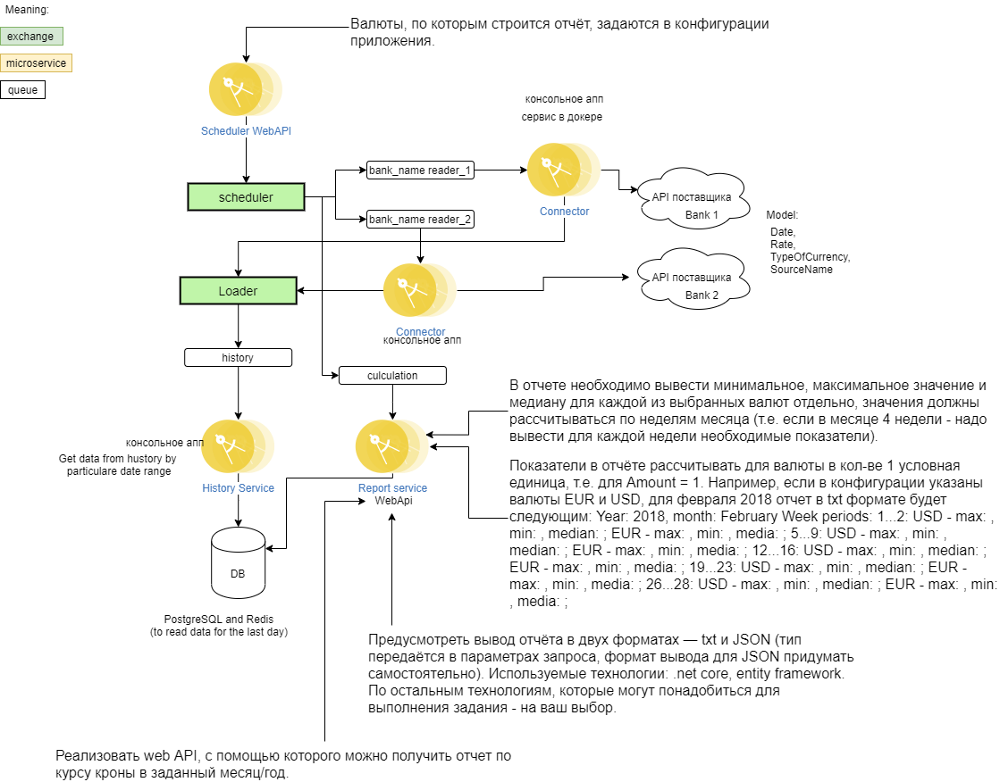
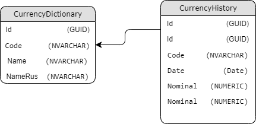

# Отслеживание обменного курса валюты (EDIT)

## Архитектура решения
  
Исходник в drawio [Architecture](./media/UpdatedArchitecture.drawio) 
Центральный банк РФ предоставляет API для отслеживания курса валют к рублю ( https://cbr.ru/development/SXML/)

Необходимо разработать систему, состоящую из компонентов:
1) Отдельное консольное приложение для заполнения БД данными валютных курсов за 2017 и 2018 год (колонка Rate в отчётах CNB).
2) Задача по расписанию, которая сохраняет текущий курс в БД. Период запуска задаётся в конфигурации.
3) Реализовать web API, с помощью которого можно получить отчет по курсу кроны в заданный месяц/год. В отчете необходимо вывести минимальное, максимальное значение и медиану для каждой из выбранных валют отдельно, значения должны рассчитываться по неделям месяца (т.е. если в месяце 4 недели - надо вывести для каждой недели необходимые показатели). Валюты, по которым строится отчёт, задаются в конфигурации приложения. Показатели в отчёте рассчитывать для валюты в кол-ве 1 условная единица, т.е. для Amount = 1.
Например, если в конфигурации указаны валюты EUR и USD, для февраля 2018 отчет в txt формате будет следующим:
Year: 2018, month: February
Week periods:
- 1...2: USD - max: , min: , median: ; EUR - max: , min: , media: ;
- 5...9: USD - max: , min: , median: ; EUR - max: , min: , media: ;
- 12...16: USD - max: , min: , median: ; EUR - max: , min: , media: ;
- 19...23: USD - max: , min: , median: ; EUR - max: , min: , media: ;
- 26...28: USD - max: , min: , median: ; EUR - max: , min: , media: ;
Предусмотреть вывод отчёта в двух форматах — txt и JSON (тип передаётся в параметрах запроса, формат вывода для JSON придумать самостоятельно).
Используемые технологии: .net core, entity framework. По остальным технологиям, которые могут понадобиться для выполнения задания - на ваш выбор.

## Архитектура БД
  
Исходник в drawio [DB](./media/DBArchitecture.drawio) 